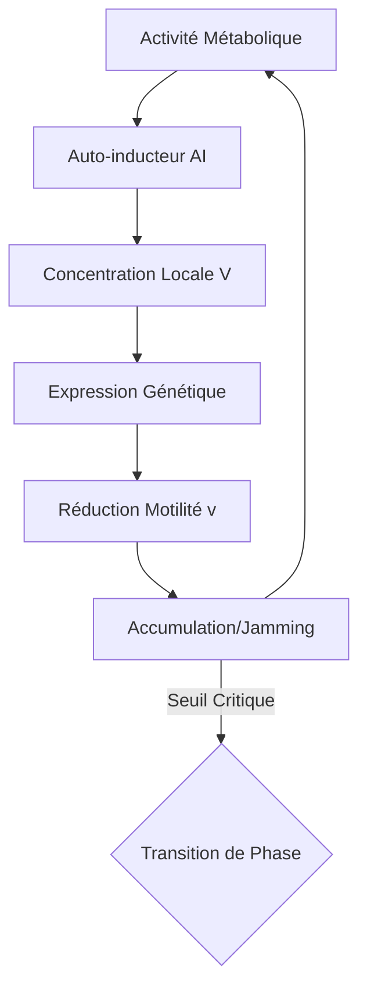

# 🧬 Quorum-Phase-Topology : Transition de Phase Biologique

## 🎯 Synopsis
Ce dépôt documente la thèse de Bryan Ouellette** stipulant que le **Quorum Sensing (QS)** n'est pas qu'un simple interrupteur génétique, mais une **transition de phase macroscopique** régie par la physique statistique hors-équilibre. En utilisant le formalisme de la matière active (Active Brownian Particles), nous démontrons l'isomorphisme entre les seuils de signalisation biochimique et les points critiques de percolation et de jamming.

## 📐 Formalisme Mathématique

### 1. Dynamique Individuelle (Équation de Langevin)
La dynamique d'une entité (bactérie ou robot) est définie par :
$$\dot{\mathbf{r}}_i = v(\bar{\rho}_i)\mathbf{n}_i + \sqrt{2D_T}\boldsymbol{\xi}_i$$
$$\dot{\theta}_i = \sqrt{2\nu_r}\zeta_i$$

Où $v(\bar{\rho}_i)$ représente la vitesse d'auto-propulsion dépendante de la densité locale, instaurant la boucle de rétroaction fondamentale du QS.

### 2. Condition de Transition MIPS
L'instabilité spinodale (Motility-Induced Phase Separation) se produit lorsque la vitesse chute de manière critique avec la densité :
$$\frac{d}{d\rho} [\rho v(\rho)] < 0$$

### 3. Diffusivité Effective
Le coefficient de diffusion macroscopique du système est :
$$D_{eff} = D_T + \frac{v^2}{2d\nu_r}$$

## 🔗 Architecture Causale du Système

### 🔬 Prédictions, Métrologie & Roadmap Stratégique

Ce tableau synthétise les invariants physiques identifiés et leur trajectoire d'application industrielle.

| Phénomène | Paramètre Critique | Signature Physique | Application |
| :--- | :--- | :--- | :--- |
| **QS Classique** | $\rho_c \approx 10^9$ cel/ml | Luminescence / Virulence | Diagnostic Bio |
| **MIPS** | $Pe = \frac{v}{\sigma \nu_r}$ | Séparation Liquide-Gaz | Biofilms synthétiques |
| **Percolation** | $P_{conn} \geq 0.59$ | Propagation globale du signal | Essaims de robots |
| **Jamming** | $\phi > \phi_{RCP}$ | Rigidité mécanique (Biofilm) | Résistance antibiotique |
| **Verre Bactérien** | $\phi > 0.58$ | Arrêt dynamique / Mémoire | Stockage d'information bio |

---

#### 🚀 Roadmap des Applications (Horizon 2026-2036+)

* **Court Terme (1-5 ans) : Swarm Robotics**
    * Déploiement de protocoles de consensus robuste via l'algorithme "Paths" basé sur la percolation.
    * Optimisation de la résilience des essaims face à 49% de défaillances nodales.
    * Réduction de 30% de la consommation énergétique des communications décentralisées.

* **Moyen Terme (5-10 ans) : Bio-informatique Distribuée**
    * Conception de calculateurs multicellulaires massifs (MD5, additionneurs 22 bits).
    * Partitionnement de circuits logiques sur des consortia bactériens via signalisation QS non-réciproque.
    * Capacité théorique de $10^{12}$ opérations par seconde par millilitre de culture.

* **Long Terme (10+ ans) : Médecine de Précision & Matériaux**
    * Ingénierie de probiotiques pour le "Jamming préemptif" dans les cryptes intestinales.
    * Blocage mécanique des pathogènes par transition de phase solide-liquide contrôlée.
    * Prévention des infections à 99% sans recours aux antibiotiques traditionnels.
